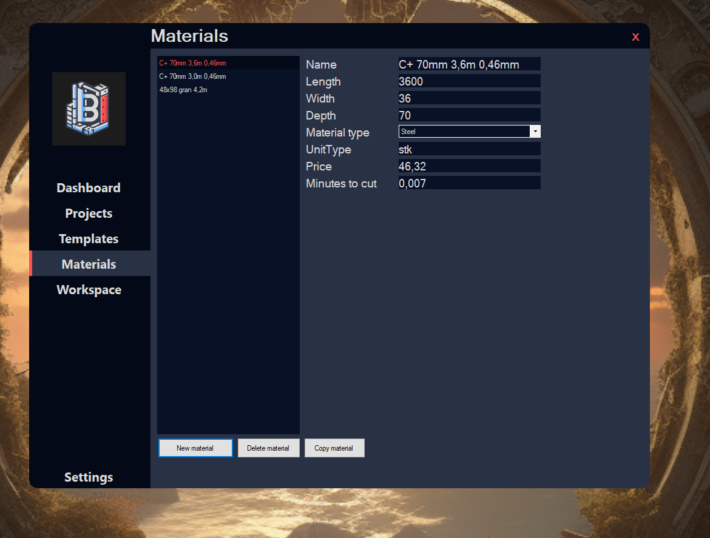

# BidBuilder

## Overview

**BidBuilder** is a Windows Forms application designed to assist project managers in the construction industry with managing projects more effectively. Although still a work in progress, the app's primary objectives include facilitating the addition of new projects, creating modules for those projects, and selecting the materials required for each module.

The application will ultimately calculate the time needed to construct the entire project, as well as the total amount of materials necessary.

## Current Features

- **User Interface:** Basic UI implemented allowing users to navigate through different tabs.
- **Materials Management:** 
  - Add new materials.
  - Edit material properties (e.g., length, width, depth, material type, price).
  - Delete materials from the list.
  
## Planned Features

- **Project Management:** 
  - Ability to create new projects and assign modules.
  - Module management for projects, including material assignment.
  
- **Calculation Engine:**
  - Automated calculation of the time required to construct the entire project.
  - Calculation of the total materials needed.

## Installation

To run this application, clone the repository and open the solution file in Visual Studio. Build and run the application to start using BidBuilder.

```bash
git clone https://github.com/Olavman/BidBuilder.git
```
## How to use
1. **Navigating tabs:** Use the tabs on the left sidebar to switch between Dashboard, Porjects, Templates, Materials and Workspace.

2. **Managing Materials:**
   - In the "Materials" tab, you can add new materials by clicking the "New Material" button although the actual adding is not yet implemented.
   - Change properties of selected materials such as dimensions, material type, and price.
   - Delete materials by selecting them and clicking the "Delete Material" button.

## Screenshots

